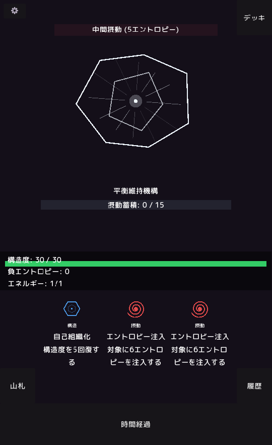

# complex



プレイは[こちら](https://godotplayer.com/games/complex)

Godot 4 製のローグライクデッキビルダー。複雑系科学をテーマにしたCard-Based Battle System。

## 概要

「complex」は、複雑系（複雑系科学）の概念をゲームメカニクスに落とし込んだローグライクデッキビルダーです。摂動・構造・触媒という3種類のカードタイプを通じて、エントロピー、秩序、相転移といった複雑系の概念を体感できます。

## 特徴

- **完全データ駆動**: カード定義、ゲームバランス、用語設定はすべてJSONファイルで管理
- **手描き風ジオメトリックアート**: CanvasItemの`_draw()`による手続き型スプライト。画像ファイル不要
- **複雑系テーマ**: エントロピー注入、構造維持、触媒効果といった科学概念をゲーム化
- **クロスバトル進行**: フロアを進むごとにデッキが成長

## 必要環境

- **Godot Engine**: 4.6 以上（プロジェクト設定: 4.6, GL Compatibility）

## プロジェクト構造

```
complex/
├── data/
│   ├── card_set.json          # カード定義（id, name, type, cost, value, color, shape, animation）
│   ├── game_config.json        # 用語・フロア設定・デバッグフラグ
│   ├── sprite_config.json      # 幾何学スプライトの形状パラメータとアニメーション設定
│   └── card_database.gd        # JSONロード・カード参照のGDScriptラッパー
├── scripts/
│   ├── autoload/
│   │   ├── game_state.gd       # グローバル状態管理（デッキ・フロア・統計）
│   │   └── settings.gd         # ユーザー設定永続化
│   ├── battle/
│   │   └── battle_manager.gd   # 戦闘ロジックの中心（デッキ・ターン・AI統制）
│   ├── ui/
│   │   ├── geometric_sprite.gd # 手続き型ジオメトリックスプライトの描画エンジン
│   │   └── card_ui.gd          # カードUI制御
│   ├── reward/
│   │   └── reward.gd           # 戦闘後の報酬選択
│   ├── stage_select/
│   │   └── stage_select.gd     # フロア選択画面
│   └── main.gd                 # メインゲームループ
├── scenes/
│   ├── main_menu.tscn          # タイトル画面
│   ├── battle.tscn             # 戦闘画面
│   ├── stage_select.tscn       # フロア選択
│   ├── reward.tscn             # 報酬選択
│   ├── defeat_screen.tscn      # 敗北画面
│   ├── clear_result.tscn       # クリア結果
│   ├── settings.tscn           # 設定メニュー
│   └── card_base.tscn          # カードPrefab
├── audio/
│   └── music/                  # BGMファイル（MP3）
├── fonts/
│   └── M_PLUS_Rounded_1c/      # 日本語対応フォント（M+ 1p rounded）
├── project.godot               # Godotプロジェクト設定
└── export_presets.cfg          # エクスポート設定

```

## データ構成

### card_set.json

6種類の幾何学形状（circle, triangle, hexagon, spiral, wave, fractal, attractor）と5種類のアニメーション（pulse, rotate, expand, oscillate, none）を持ちます。カードは3タイプに分類されます。

- **perturbation** (摂動): 対象にエントロピーを注入する。主に敵を攻撃。
- **structural** (構造): プレイヤーの構造度を回復する。主に防御・回復。
- **catalyst** (触媒): 他の作用を増幅・変換する。特殊効果・コンボ補助。

各カードはカラー（RGB 0.0-1.0）と形状アートをJSONで定義。画像ファイルは不要です。

### game_config.json

ゲーム全体の設定を管理する中心ファイルです。

- **terminology**: UI表示名のローカライズ（構造度、摂動蓄積など）
- **floors**: 各フロアの敵名・色・安定化閾値・敵意図パターン
- **player_defaults**: プレイヤー初期値（最大構造度、開始エネルギー、1ターンのドロー数）
- **card_types**: カードタイプのラベルと説明
- **reward_count**: 報酬画面で選べるカード数
- **scene_flow**: 全シーン遷移パスの一元管理（`get_scene_path()` 経由で参照）
- **debug_mode**: デバッグ機能の一括制御

### sprite_config.json

各形状の描画パラメータ（半径、辺数、深さなど）とアニメーションパラメータ（速度、振幅）を定義。`enemy_sprites` では敵ごとの形状・色を設定します。

## カードタイプ一覧

| タイプ | 日本語ラベル |  설명 | 主な用途 |
|--------|------------|------|----------|
| perturbation | 摂動 | 対象の構造にエントロピーを注入する作用 | 攻撃・エントロピー蓄積 |
| structural | 構造 | システムの秩序度を回復・維持する作用 | 回復・バリア生成 |
| catalyst | 触媒 | 他の作用を増幅・変換する仲介的効果 | コンボ・特殊変換 |

## ゲーム用語（テーマ: 複雑系）

| ゲーム内用語 | 意味 | 複雑系での対応概念 |
|--------------|------|-------------------|
| 構造度 | HP | 秩序/組織化の度合い |
| 最大構造度 | Max HP | 最大秩序度 |
| 負エントロピー | シールド | エントロピー逆転・局所秩序化 |
| 摂動蓄積 | 敵ダメージバー | エントロピー蓄積量 |
| 相転移閾値 | 敵最大ダメージ | 相転移を起こす臨界点 |
| エネルギー | Energy | 系の work capacity |
| 可能性空間 | Draw デッキ | 未使用カードプール |
| 履歴 | Discard デッキ | 使用済みカードプール |
| 作用点 | Hand | 現時点で実行可能な作用 |
| 時間経過 | End Turn | 離散時間ステップ |
| 安定化達成 | Victory | 秩序状態への到達 |
| 熱的平衡 | Defeat | 最大エントロピー状態 |

## 主要スクリプト解説

### BattleManager (battle_manager.gd)

戦闘の中心コントローラ。プレイヤーのデッキ管理、ターン進行、敵AIの意図選択、カード効果の実行、勝利/敗北判定を統括します。

- `_start_battle()`: フロア設定とプレイヤー初期値のロード、敵名とスプライトの設定、デッキの初期化
- `_on_end_turn()`: カード破棄→プレイヤー効果→敵行動→カード補充の4フェーズを実行
- `_apply_card_effect()`: カードタイプ別に効果を分岐して適用
- `_enemy_turn()`: 敵AIが現在の摂動蓄積状態から意図を選択

### GeometricSprite (geometric_sprite.gd)

`_draw()` による手続き型描画エンジン。JSONから形状・アニメーションパラメータを読み込み、`_draw_circle()`、`_draw_polygon()`、`_draw_spiral()`、`_draw_wave()`、`_draw_fractal_tree()`、`_draw_attractor()` の6種類の描画関数でアートを生成します。

- `configure()`: card_data から形状・色・アニメーション種別を抽出し、sprite_config.json から詳細パラメータを取得
- `_process()`: アニメーション時間を更新し、`queue_redraw()` で毎フレーム再描画
- 6種の幾何学形状 + 5種のアニメーションの組み合わせで多様なカードアートを実現

### GameState (autoload/game_state.gd)

Autoload として全シーンからアクセス可能なグローバル状態。`game_config.json` をキャッシュ読み込みし、`current_floor`、`player_deck`、`total_battles`、`entropy_history` などのラン情報を永続化します。

- `get_floor_config(idx)`: 指定フロアの設定辞書を返す
- `get_terminology(key)`: 用語のローカライズ済み表示名を取得
- `get_scene_path(key)`: scene_flow からシーンパスを取得（全シーン遷移がこの関数経由）
- `reset_run()`: ニューゲーム時に全状態をリセット

## 用語集

用語の日本語⇔英語対応や複雑系用語の解説は `~/complex-data/用語集.md` にまとめられています。テーマ変更時はこのファイルを編集してください。

## 遊び方

1. **ゲーム開始**: `Project → Run` (F5) でエディタ内実行。`main_menu.tscn` が自動起動します。
2. **フロア選択**: `stage_select.tscn` でフロアを選択。現在フロアが `GameState.current_floor` で管理されます。
3. **戦闘画面**: 手札からカードを選択し、敵を攻撃または自己回復。毎ターン1エネルギーを回復。
4. **勝利条件**: 敵の「摂動蓄積」バーを「相転移閾値」以上にすると `安定化達成` (Victory)。
5. **敗北条件**: プレイヤーの「構造度」が0になると `熱的平衡` (Defeat)。
6. **報酬**: 戦闘後に `reward.tscn` でカード追加や強化を選択。デッキは `GameState.player_deck` に保存され、次のバトルに持ち越し。

## デバッグモード

`data/game_config.json` の `"debug_mode": true` で有効化されます。

- 戦闘開始時に `stability_threshold`（相転移閾値）を 1 に設定
- カード選択時に詳細情報をコンソール出力
- デバッグ用ボタンの表示

## エクスポート

`export_presets.cfg` にエクスポート設定が事前定義されています。Godot エディタの `Project → Export` から、Windows (x64)、Linux (x64)、Web 他向けにビルド可能です。

## 既知の制約

1. **幾何学形状の制限**: 現状7形状（circle, triangle, hexagon, spiral, wave, fractal, attractor）。`geometric_sprite.gd` に形状描画関数を追加することで拡張可能。
2. **カードエフェクト**: 複雑な条件分岐が必要な効果は戦闘バランス上保留中。
3. **セーブデータ**: セッション内のみ保存。ブラウザローカルストレージへの永続化は未実装。
4. **BGM**: 1トラックのみ (`_music_techno_t6.mp3`)。フロアごとのBGM切り替えは未実装。
5. **アニメーション**: `_draw()` ループ依存の軽量アニメ。パーティクルエフェクトは未実装。
